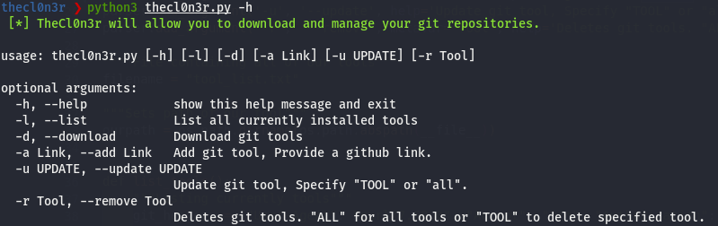

# TheCl0n3r
TheCl0n3r will allow you to download and manage your git repositories.

# Preface
About 90% of the penetration testing tools used in my experience can be found primarily on github. The aim of this was to make it easier to download, update and delete git repositories. If moving to a new testing system make it simpiler to tranfer the same tool set used.

## Usage


## listing currently installed tools


## Requirements
* Python3


## Installation:
```
git clone https://github.com/an00byss/TheCl0n3r
cd TheCl0n3r
pip3 install -r requirements.txt
python3 thecl0n3r.py
```

## To Do:
- [ ] Add github search