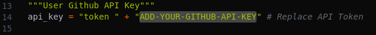

# TheCl0n3r
TheCl0n3r will allow you to download and manage your git repositories.

## Preface
About 90% of the penetration testing tools used in my experience can be found primarily on github. The aim of this was to make it easier to download, update and delete git repositories. If moving to a new testing system, make it simpler to transfer the same tool set being used.

## Usage


## listing currently installed tools


## Requirements
* Python3
* Github Access Token


## Installation:
```
git clone https://github.com/an00byss/TheCl0n3r
cd TheCl0n3r
pip3 install -r requirements.txt
python3 thecl0n3r.py
```
## Note:
Must add Github Access Token to "api_key" variable.


> When deleting all tools TheCl0n3r will create a backup tools_list.txt.bak file with all previously installed tools. :relieved:

## To Do:
- [ ] Add github search