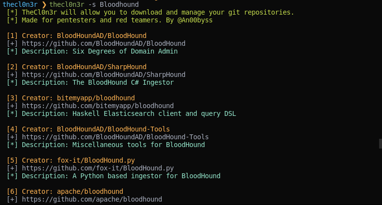
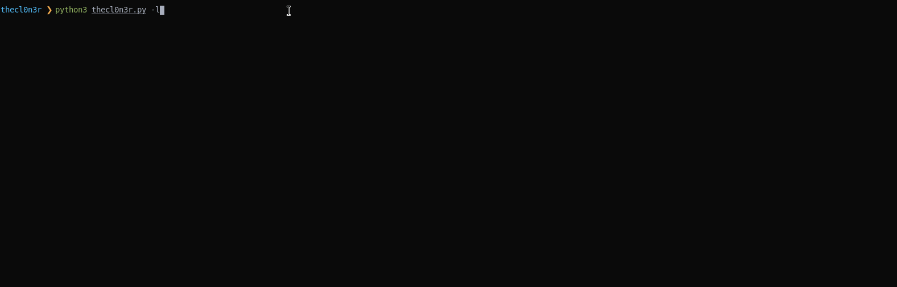

# TheCl0n3r
TheCl0n3r will allow you to download and manage your git repositories.

## Preface
About 90% of the penetration testing tools used in my experience can be found primarily on github. The aim of this was to make it easier to download, update and delete these git repositories. If moving to a new testing system, make it simpler to transfer the same tool set being used.

## Usage


## Search Github


## Listing currently installed tools


## Features
* Download repos
* Updates repos
* Deletes repos
* Search github repos
* Install Go & Python tools.
* Keeps everything orgainzed

### Quick setup
* If you already have a list of tools in you are using just add it to the tool_list.txt file inside the TheCl0n3r directory then: "python3 thecl0n3r.py -d"
* When moving to a new system just copy over the tool_list.txt file and re-download... Cake :wink:

## Requirements
* Python3
* Pipenv
* GO
* Github Access Token

### Install Pipenv
* https://pypi.org/project/pipenv/

### Install GO
* https://golang.org/doc/install

## Installation:
```
git clone https://github.com/an00byss/TheCl0n3r
cd TheCl0n3r
pip3 install -r requirements.txt
python3 thecl0n3r.py
```
## Note:
Must add Github Access Token to "api_key" variable.


> When deleting all tools TheCl0n3r will create a backup tools_list.txt.bak file with all previously installed tools. :relieved: